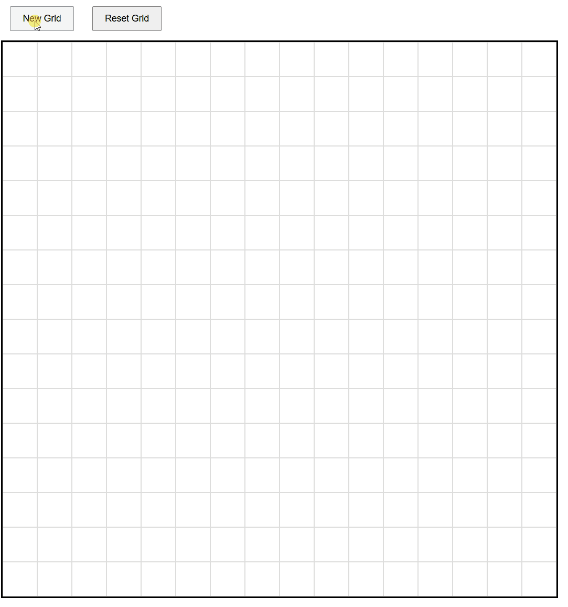

# Project: Etch-A-Sketch
## Created a grid that displays different grey to black color change whenever the left-mouse button is clicked and hovers above the grid.
## Demo

# Features
- When the index.html file is opened the user can create a new grid with a max value of 100 and sketch over the grid with the left-mouse click button.
- The user can also choose to reset the grid into a blank grid.

# Technologies Used
- Languages: HTML, JAVASCRIPT.
- Deployment platform: vscode and broswer.

# Installation Instructions
1. Clone the respository
2. Open the folder and then open the index.html file on any browser.

# Future Improvements
- Adding a home page or main page
- Creating a user authentication prompt (enter email, password, signup, login)
- Rebuildin/transfering into a react framework
- Api Intergration

# Author information
## Mbuso Mabuza
## Email: mbusomabuza99@gmail.com
## LinkedIn profile: https://www.linkedin.com/in/mbuso-mabuza-05851530a/
